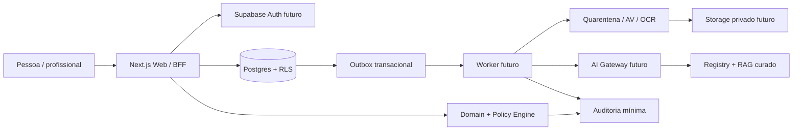

# Arquitetura v0.1

Status: proposta implementada parcialmente na base; revisão jurídica/produto continua pendente.

## Contexto e componentes

Nesta entrega a Web usa fixtures, sem caminho Web→DB/Auth. Migrações/testes cobrem o DB separado.
O handler worker é puro; não existe consumidor persistente. A health API verifica apenas a Web, não o banco.

## Boundaries

- case: metadados comuns mínimos, status, país, modo. Dados privados em workspace, não em cases.
- workspace: private A, private B, shared, professional-only, compliance-restricted. Nunca passar o caso inteiro ao modelo.
- tenant: organização B2B; não equivale a acesso ao workspace. Relação explícita com caso e grant é obrigatória.
- domain: schemas determinísticos, transições, dinheiro em centavos, preparação.
- policy: decisão versionada com classe, canExecute, motivo e rule ID; servidor constrói contexto.
- audit: somente metadados mínimos, payload canônico e cadeia serializada por caso.
- document: original imutável, derivados versionados, scan results anexados; fatos candidatos com fonte por versão/página.

## Contratos para os próximos endpoints

Autenticar JWT no servidor; não confiar em actor_id, modo, tenant, scope ou approval enviados como autoridade pelo browser.
Queries com sessão do usuário/RLS; service_role apenas em tarefas restritas e explicitamente auditadas.
Sessão recente + MFA do profissional verificadas a cada ação de impacto; não reutilizar cache de grant após revogação.

| Operação futura | Autorização / resultado | Transação e eventos |
|---|---|---|
| POST /api/cases | membro humano, SELF_SERVICE por padrão; cria private A sem contraparte | case + workspace + membership + audit + outbox |
| POST /api/cases/:id/intake | acesso ao workspace, schema_version e confirmação | snapshot + fact candidates + audit |
| POST /api/documents/upload-intent | tamanho/MIME, workspace, usuário | metadados QUARANTINED + URL curta/limitada; scan via worker |
| POST /api/facts/:id/confirm | fonte autorizada, confirmação explícita, versão corrente | fact confirmation + audit; rejeitar stale version |
| POST /api/professional-grants | consentimento específico e profissional verificado | grant workspace/expiry + audit; revoke em endpoint separado |
| POST /api/case-packs | seleção explícita de escopos; não adicionar scope por inferência | snapshot/manifeste/hash, registro export e storage protegido |

API atual: GET /api/health retorna synthetic-demo/persistence=false. Nenhum endpoint acima foi entregue.
Erros futuros: 401 sessão inválida, 403 sem permissão, 409 conflito de versão/idempotência, 422 validação,
429 limite, 503 dependência indisponível; não confirmar existência de objeto inacessível.

## Idempotência e concorrência

Chave: actor_id + case_id + operation + idempotency_key. Hash do pedido normalizado após validação;
mesma chave e hash retorna resposta original, hash diferente dá 409. Registro e mutação no mesmo commit.
Outbox usa IDs estáveis e consumidor com inbox/dedupe; entrega at-least-once, não exactly-once mágico.
Retries com backoff/jitter, lease e limite; esgotamento vai a DLQ e revisão sem conteúdo sensível em logs.
A tabela foi entregue; handler transacional ainda não.

Envio futuro: lock do canal, reavaliar safety/grant/consentimento, vincular approval ao hash final e destinatário,
append da mensagem + audit + outbox no commit. Recibos independentes. Redis só quando métricas justificarem.

## Deploy e decisões

Dev/test/staging/prod separados. Dados sintéticos sempre em dev. Sem analytics externos nesta base.
PWA/offline não habilitado; não cachear conteúdo sensível no navegador por padrão.
Versionar migrations, schemas, policies, prompts e datasets; nenhuma regra jurídica ativa sem review.
ADRs explicam decisões e alternativas. Flags futuras são controles operacionais do servidor, não parâmetros do usuário.
