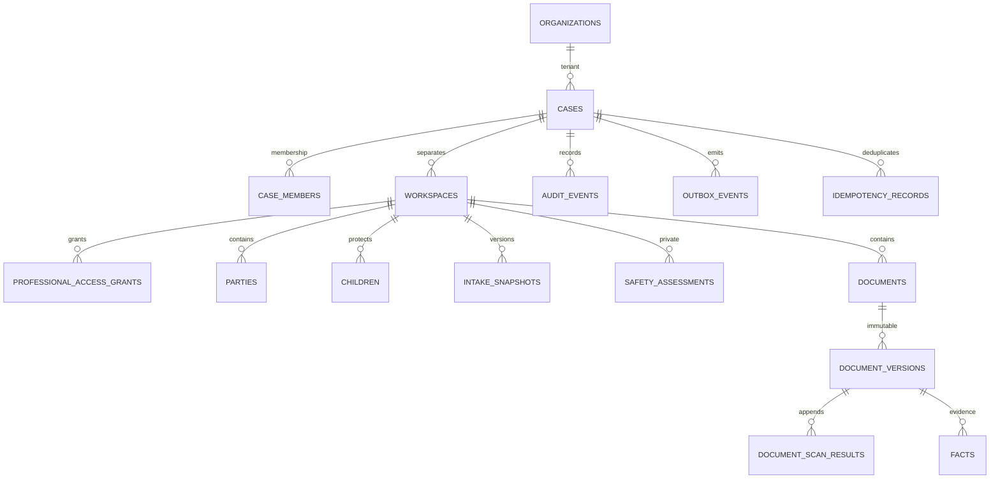

# Modelo de dados e RLS v0.1

Alvo: Supabase/Postgres 17 + pgvector. Testado em Postgres real com auth/roles simulados apenas no bootstrap de teste.
Aplicar migrations 0001, 0002 e 0003 em ordem; NÃO aplicar packages/db/tests/bootstrap.sql em Supabase.
Scripts de migração são one-shot com histórico de runner: não rerodar CREATE TYPE/TABLE em banco já migrado.
0003 é aditiva e inclui proteção de TRUNCATE documental e centavos seguros para monthly_income_cents.
Dados financeiros inválidos pré-existentes interrompem a migration; auditar/corrigir por procedimento autorizado, sem arredondar evidência.
A alteração em 0001 limita REVOKE às tabelas do core para novas instalações. Não reaplicar 0001 em banco já migrado;
permissões de outros módulos afetadas pela versão antiga precisam ser revisadas a partir do histórico, sem GRANT amplo.

Entregues: organizations, organization_members, cases, case_members, workspaces, professional_access_grants,
parties, children, intake_snapshots, safety_assessments, documents, document_versions, document_scan_results, facts;
audit_events/outbox_events/idempotency_records em schema app_private.
Ainda não: consents, finanças, messages/receipts/proposals, source registry SQL, export records e inbox/leases.
Registry jurídico JSON é documentação com referências pendentes, não tabela em produção.

## Invariantes

- FK (workspace_id,case_id) impede identidade de caso misturada. Fatos DOCUMENT referenciam versão do mesmo workspace/caso.
- Fato CONFIRMED exige confirmed_by/at. Isso registra confirmação, não certifica verdade.
- monthly_income_cents exige JSON numérico inteiro, não negativo e dentro do limite de Number.MAX_SAFE_INTEGER.
- Versões originais e scan results são imutáveis; document status é separado e mutável por futuros comandos autorizados.
- Triggers documentais também recusam TRUNCATE, incluindo CASCADE; não protegem contra DBA que remove/desativa os guards.
- Um shared workspace pode existir sem canal bilateral. Nenhum endpoint de compartilhamento está habilitado.
- Safety UNKNOWN não é NORMAL. Avaliações são privadas; não colocar relato de violência em cases.
- grants por workspace, proprietário concedente, profissional, consent_reference e expires_at. consent_reference ainda não tem FK.
- Restrição inicial: um workspace por case/scope; múltiplos workspaces profissionais precisam de evolução antes de B2B amplo.
- service_role e proprietário de migração têm privilégio especial: RLS não os torna seguros. Jamais expor no browser.

## Matriz de leitura atual

| Ator | Metadados case | Privado próprio | Privado da contraparte | Shared | Professional-only | Compliance |
|---|---|---|---|---|---|---|
| A/B membro ativo | sim | sim | não | sim | não | não |
| Profissional aal1 | não | não | não | não | não | não |
| Profissional aal2 + grant vivo | caso concedido | só workspace concedido | só se dono também conceder | sem grant não | reservado; sem fluxo integrado | não |
| Colega do mesmo escritório | não por ser colega | não | não | não | não | não |
| Anônimo | não | não | não | não | não | não |

Profissional não é automaticamente membro das partes. Revogação/expiração são verificadas a cada statement;
cache ou URLs assinadas futuras exigem mecanismo adicional de curta vida/revalidação.
Nesta base authenticated tem SELECT e nenhuma escrita. Management endpoints e comandos transacionais ainda não implementados.
Funções auxiliares SECURITY DEFINER têm search_path vazio e EXECUTE restrito; schema app_private não deve ser exposto no REST.

## Auditoria

append_audit é a única entrada concedida a service_role; sem INSERT direto. Lock advisory por caso serializa a sequência.
Preimage: coalesce(previous_hash,'') + LF + payload_canonical (jsonb::text persistido, UTF-8). SHA-256 em hex.
Envelope contém case_id/sequence também dentro do payload. Verificador compara ambos.
Triggers recusam UPDATE/DELETE/TRUNCATE na auditoria; superuser ainda pode desabilitar triggers. Checkpoint externo é pendente.
Nenhum read geral de audit para authenticated: criar visão filtrada/auditada para profissional/compliance no backlog.

## Testes e limites

npm run test:db usa role authenticated sem BYPASSRLS, sub/aal controlados apenas pela fixture de teste.
Verifica A/B, outro caso, colega, MFA, grants/expiry/revocation, FKs, escrita indevida, append-only e concorrência real.
Não comprova assinatura JWT, Supabase Storage, Realtime, JWT refresh, MFA real, APIs ou deployment.
Antes de Supabase real, revisar default grants de tabelas/funções, exposed schemas e rôles do projeto.
Backups/RLS em ambiente hospedado precisam de validação adicional no ticket de integração.
