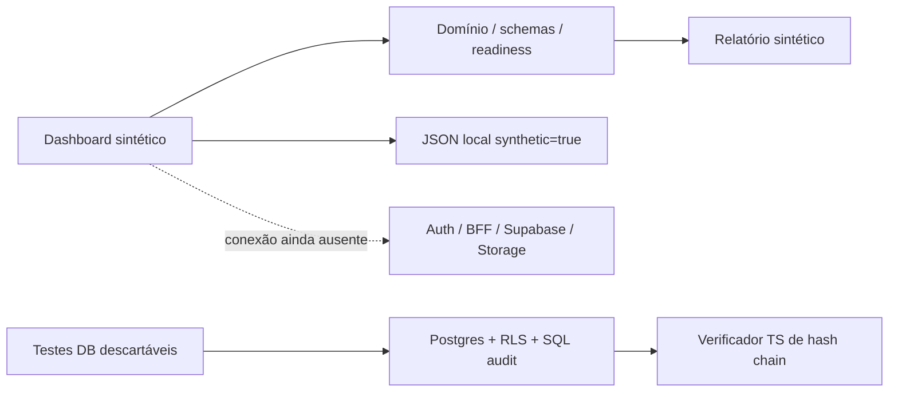

# Revisão de ponta a ponta — v0.3

Registro da auditoria do código até e7af2d9. Depois desta auditoria, o responsável solicitou integração em main
e transferência técnica; entrega atual em [HANDOFF](../team/dev/HANDOFF.md).
As observações sobre branch/main e ausência de merge abaixo descrevem o estado durante a auditoria.
Integração Git atual na [matriz](INTEGRATION-STATUS.md); os bloqueios de funcionalidades reais continuam válidos.

## Conclusão

**Não podemos confirmar que tudo está integrado.** Existe uma base de engenharia com fluxo sintético de ponta a ponta
na Web e componentes de domínio/SQL/auditoria testados localmente. Não existe o fluxo real
login → caso persistido → documento processado → revisão profissional → entrega autorizada.

Esta revisão cobre o checkout de mgjexpert/legaltech baseado no commit 6489930ea1740ded7c4b332308334ae394ece57c,
as refs Git remotas, todos os módulos de código presentes, migrations/testes e a documentação de produto,
equipe, marketing e assistência. Corrigimos defeitos reproduzíveis da base; isso não prova ausência universal de falhas.

Estado por componente: [matriz canônica](INTEGRATION-STATUS.md), gerada do [JSON](INTEGRATION-STATUS.json).
Evidência de execução: [registro da revisão](REVIEW-EVIDENCE.json). A entrega anterior permanece no [registro v0.1](VALIDATION.md).

## O que está conectado de fato

O handler worker usa o domínio, mas não executa como daemon nem consome outbox.
Policy Engine é uma biblioteca local; nenhuma API real de envio/compartilhamento chama essa biblioteca.
health=ok verifica somente a Web e declara persistence=false. Não comprova DB/Auth prontos.

## Defeitos corrigidos nesta revisão

| ID | Defeito confirmado / impacto | Correção | Regressão |
|---|---|---|---|
| A01 | TypeScript sozinho não validava contexto runtime; strings truthy podiam gerar permissão, null gerava exception | Contexto estrito com enums e booleans; entrada malformada retorna BLOCK | 8 novos casos de policy; catálogo de 25 contratos preservado |
| A02 | UF ZZ passava no regex de duas letras | Enum com 27 unidades federativas | UF inválida e SP/DF válidas |
| A03 | Fato monthly_income_cents aceitava texto, boolean, negativo, fração e overflow | Validação de centavos no domínio e constraint SQL 0003 | 5 rejeições no domínio e DB, zero válido |
| A04 | REVOKE ALL ON ALL TABLES afetava tabelas de outros módulos em public | 0001 limita revogação aos objetos do core | Tabela externa mantém SELECT após migrations |
| A05 | Document versions/scan results protegiam UPDATE/DELETE, mas TRUNCATE podia contornar o guard | Migration adicional 0003 com triggers BEFORE TRUNCATE | TRUNCATE direto/CASCADE recusado no Postgres |
| A06 | Runner DB confundia servidor temporário de init com servidor final; testes paravam durante shutdown | pg_isready por TCP no loopback interno | Runner completo após startup final, sem porta publicada |
| A07 | E2E podia reutilizar app antigo/local e testava dev por padrão | Artefato de produção em servidor exclusivo porta 3100; reuse=false | Fluxo/browser/headers/mobile em processo iniciado pelo runner |
| A08 | Links/JSON/matriz podiam divergir sem verificação na CI | check:docs + geração da matriz + checagem no workflow | Checker recusa link quebrado e drift da tabela |

A01 não é um ataque comprovado a endpoint de produção: nenhum endpoint de ações existe.
A06 apareceu nesta execução e exigiu diagnóstico do entrypoint da imagem Postgres, que inicializa usando socket sem TCP.
Controles de schema são complementares; não substituem JWT, autorização, consentimento ou profissional verificado.

## Migrations e compatibilidade

Aplicar 0001 → 0002 → 0003 somente com histórico de migrations.
0003 é aditiva para bancos que já receberam 0002; trava em renda inválida pré-existente, sem arredondar ou alterar evidência silenciosamente.
Antes de aplicá-la em banco existente, auditar fatos financeiros, preservar dados e confirmar backups/restore.
Não reaplicar 0001/0002 em banco já migrado. A mudança do REVOKE em 0001 vale para novas instalações.
Se a versão anterior já removeu permissões de outros módulos, reconstruí-las a partir de configuração/histórico conhecido;
não conceder acesso amplo por tentativa. Nenhum banco de produção foi migrado nesta revisão.

## Pendências que bloqueiam integração real / Pilot 1

| Prioridade | Pendência | Ticket / owner sugerido | Evidência exigida para encerrar |
|---|---|---|---|
| P0 | Sessão/JWT/MFA/professional identity | 008/038 — Backend/Security | login/logout/expiry/recovery reais; aal2/identity verificados; E2E negativo |
| P0 | Consent table/versões/finalidade/revogação | 031/036 — Backend/Privacy | FK nos grants, finalidade/scope/recipient, opt-out e DSR testados |
| P0 | BFF de criação/leitura e comandos transacionais | 005/006/016/033 — Backend | actor confiável, session/RLS, atomic audit/outbox, replay/mismatch/concorrência |
| P0 | Supabase/Storage integrados | 009/010/019/020 — Backend/Security | acesso A/B/tenant via API e storage, quarantine/download/MIME/AV reais |
| P0 | Grants e handoff profissional | 028/029 — Backend/Web | convite/identity/MFA/expiry/revoke, scope/export E2E, audit e snapshot |
| P0 | Privacy/provider/retention/ops | 036/039/040 — Privacy/Legal/Ops | RIPD/termos/bases/owners, provedores aprovados, backup/restore e incident drill |
| P1 | Document parsing e evidence real | 021/022/023/024 — Backend/QA | isolamento de parser, confidence/page/version, clean-scan gate e confirmação |
| P1 | Finanças/readiness persistidos | 025/026 — Backend/Web | moeda/período/proveniência, divergências, recuperação de sessão e snapshot |
| P1 | Registry/RAG/route jurídico | 012/013/014/015/027 — Legal/AI | texto oficial/version/hash/vigência, review independente, citação/refusal |
| P1 | Gateway/context e evals de modelo | 030/034 — AI/QA/Legal | minimização/ACL/cache, provider fail, injection/leakage e thresholds aprovados |

Bridge/negociação são Pilot 2/3; todos os gates de safety, identidade e consentimento continuam bloqueadores.
As 25 golden fixtures são contratos determinísticos, não avaliação de LLM ou detecção de abuso.
As 18 fixtures da assistência são propostas NOT_EXECUTED, não testes passados.
Fontes do Blueprint não foram aprovadas por esta revisão; 17 referências, incluindo benchmarks/licenças, continuam pendentes no registry.

## Melhorias arquiteturais recomendadas

1. Fechar primeiro uma vertical sem LLM: sessão → caso privado → intake persistido → documento em quarentena → confirmação → pack autorizado.
2. Implementar consentimentos antes de liberar qualquer grant real; distinguir scope de workspace de permissão por categoria (especialmente safety/children).
3. Definir owners nominais, checklists de release e ambiente staging separado; mapa de dependências/erro/rollback por serviço.
4. No pipeline: clean scan ligado ao hash/versão exatos, MIME por bytes, limites, revisão humana, quarentena em timeout e egress mínimo.
5. Tipar fact keys e períodos/valores; a correção de renda atual não constitui o schema financeiro completo.
6. Para B2B, evoluir limite de um PROFESSIONAL_ONLY por caso e seu modelo de concessão; enum reservado não é workspace profissional funcional.
7. Inserir finalidade/ACL também em RAG, cache, embeddings e export; service_role não é reader de usuário.
8. Implementar checkpoint externo da auditoria e política de retenção/hold; cadeia local não detecta reescrita por DBA ou suffix truncation sem âncora.
9. Antes de produção, CSP com nonce/estratégia Next revisada, rate-limit, payload limits, monitoramento sem PII, secrets manager e restore drill.
10. Adotar Hermes somente depois de POC/evals isolados; não compartilhar memória, creds ou ferramentas com o core.
11. Marketing/assistência usam catálogo fiel do release; sem preço/feature inventados ou integração comercial suposta.
12. GitHub: review/merge controlado da foundation, proteção de branches, Actions por SHA se a política exigir, revisão de dependências/licenças/SBOM.
    Nenhum merge/deploy foi executado pela auditoria.

## Limites da verificação externa

Git HTTPS/proxy funcionou: branch foundation publicada, main na ref inicial.
A API https://api.github.com/repos/mgjexpert/legaltech retornou Forbidden. O plugin GitHub não forneceu ferramentas chamáveis nesta sessão;
usamos Git/CLI existentes. Não podemos atestar CI remota, PRs, branch protection ou deploy hooks.
Nenhuma credential foi solicitada por faltar token: binding existente foi reutilizado, sem expor valores.
Não há bindings Supabase/hosting na configuração inspecionada nem variáveis correspondentes no processo; isso não prova que contas externas não existam.
Conclusão de ausência de integração Web/DB vem do código: fixtures, ausência de auth/client/loader e único endpoint health.

Vercel, Supabase hospedado, Cloudflare, VPS, CRM, canais sociais e providers precisam de acesso/evidência próprios para validar operações reais.
Não foram provisionados, publicados ou enviados conteúdos por esta revisão.
Nenhum SLA, certificação, conformidade jurídica/LGPD ou “zero defeitos” é confirmado por testes locais.

## GO / NO-GO

- **GO desenvolvimento sintético:** checks locais e documentação reproduzíveis; equipe pode continuar implementação.
- **NO-GO casos reais / Pilot 1:** auth/consent/BFF/storage/ops integrados e revisão independente ainda pendentes.
- **NO-GO Navigator público:** fontes/versionamento/citações/evals de modelo ausentes.
- **NO-GO Bridge/negociação públicos:** funcionalidades e gates de safety/identity/human operations não implementados.

Próxima ação concreta: FRO-031 + FRO-008 + FRO-033, validar Supabase staging por API/Storage e persistir a primeira vertical.
Depois documentos/readiness/handoff, com os gates correspondentes. Não comprar/ativar Hermes ou canal comercial para compensar essa integração ausente.
