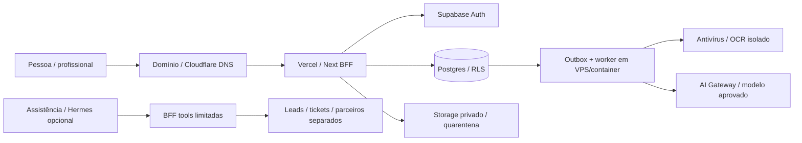

# Stack tecnológica e próximos passos

Recomendação para a base atual: GitHub + Vercel + Supabase. Cloudflare para domínio/DNS e proteção de borda.
Worker persistente em um serviço de containers gerenciado ou VPS quando entrar processamento documental.
Hermes é uma opção separada para operações; não é requisito do MVP nem substitui Policy Engine/RLS.

## O que contratar e quando

| Serviço | Papel | Agora: desenvolvimento/testes | Antes do piloto com casos reais |
|---|---|---|---|
| GitHub | código, branches, PR, Issues e Actions | necessário; repositório existente mgjexpert/legaltech | branch protection, reviewers e permissões mínimas |
| Vercel | hospedar Next.js/BFF | recomendado para staging sintético após configuração; local também funciona | contas/equipe, região, secrets, acesso às previews, plano/termos adequados |
| Supabase | Postgres/pgvector, Auth/MFA, Storage privado | criar projeto de staging e integrar; SQL local já existe | projeto prod separado, RLS/Storage/E2E, backups/restore, consentimentos e configuração revisada |
| Cloudflare | domínio/DNS; WAF/rate limit quando escolhido | opcional para teste; escolher domínio e proteger conta | DNS/TLS e política de borda; proxy/WAF dependem da integração validada |
| VPS ou managed containers | worker OCR/AV/filas e agente persistente | dispensável para o dashboard; útil no spike documental | worker isolado, quotas, patching, secrets/egress, logs mínimos e monitoramento |
| Provedor IA empresarial | extração/informação assistida pelo gateway | dispensável para a base; fixtures determinísticas | contrato/DPA/no-training/retention, evals e gateway; modelo a selecionar |
| Email transacional | verificação/convites/notificações | sandbox ou infraestrutura Auth revisada; provedor a selecionar | domínio remetente, SPF/DKIM/DMARC, opt-out e mensagens sem narrativa sensível |
| OCR + antivírus | tratar uploads em quarentena | spike e testes sintéticos | limites, scanner atualizado, parsing isolado e ACL em storage |
| Observabilidade | erros, métricas técnicas e alertas | logs mínimos locais/CI | solução gerenciada ou própria, redaction, retenção e owners; sem PII automática |
| Redis/queue externa | coordenação de filas se necessário | adiar; começar com outbox Postgres + consumidor | decidir por throughput/leases/retries; não é necessário só porque existe worker |
| CRM/support inbox | contatos de leads/parceiros e atendimento | escolher fluxo mínimo; arquivos Git são especificação | registros fora do Git, ACL/retention/consent; casos familiares separados |
| Meta/Google/LinkedIn/WhatsApp Business | aquisição e notificações | criar contas humanas se desejado; materiais em marketing/ | orçamento/consentimento/review explícitos; canais não guardam case pack |

Vercel e Cloudflare não precisam hospedar a mesma Web. A opção proposta usa Vercel para Next e Cloudflare para DNS/borda.
Cloudflare Workers/Pages seria uma alternativa a avaliar com compatibilidade Next e requisitos de execução; não adotar dois hosts por padrão.
Domínio, Vercel, Supabase e cloud worker são contas distintas. Não criar planos pagos automaticamente.

## Desenho alvo

A seta DNS representa resolução; proxy Cloudflare é configuração opcional, não integração já feita.
Serviços ainda não estão provisionados ou ligados à Web. A aplicação atual é sintética e não autentica/persiste.

## VPS: decisão prática

Primeiro testar container gerenciado com processo de worker, logs e restart controlados; uma VPS dá mais controle e exige mais operação.
Para um spike sem GPU: orçamento técnico inicial 2 vCPU / 4 GB RAM / SSD, depois medir PDFs, scanner, concorrência e memória;
isso não é garantia de capacidade nem cotação. Separar parser não confiável e agente Hermes do processo que usa credenciais privilegiadas.
Para Hermes independente, usar isolamento próprio e limitar memória/CPU/egress; não compartilhar filesystem do core ou credenciais prod.
Não hospedar modelo grande/GPU nesta VPS pequena; usar API aprovada ou sizing específico se optar por self-hosted.

## Ordem de execução

1. Colocar foundation e estas pastas em branch GitHub para review; a criação da branch não equivale a merge/deploy.
2. Nomear tech lead, product, counsel/privacy e safety; aceitar ADRs e definir região/contas/domínio.
3. Integrar auth/MFA (FRO-008), consentimentos (031) e comandos transacionais (033) com Supabase staging.
4. Validar RLS também via API e Storage; tirar o dashboard das fixtures apenas no staging autorizado.
5. Implantar staging sintético Vercel e CI; previews privadas, sem dados reais e sem service_role no browser.
6. Fazer spike worker+AV/OCR (019–023); depois finanças/readiness/handoff.
7. Completar evals, privacy/provider review, backup/restore e operação antes de Pilot 1.
8. Ativar campanhas e assistência externa apenas com aprovação de materiais, canal, orçamento e tratamento de dados.
9. Avaliar Hermes em POC interno/sintético separado. Bridge/negociação seguem Pilot 2/3.

## Custos e responsabilidades

Não foram consultados preços atuais ou adquiridas assinaturas. Free tiers servem para experimentos quando os termos/limites permitirem;
não presumir backup/SLA/região/commercial use adequados só por serem gratuitos.
Custos variáveis: hosting, DB/storage/egress, worker/OCR, IA por uso, email e mídia. Definir budget por ambiente e limites de uso.
Infra privada nunca vai em README: secret manager/variáveis do provider. Tokens e dados de clientes não entram no Git.

Guias: [time dev](../team/dev/README.md), [marketing](../marketing/README.md), [assistência IA](../ai/customer-assistance/README.md), [Hermes](../ai/customer-assistance/integrations/HERMES-ASSESSMENT.md).
